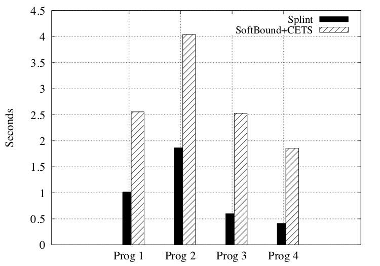
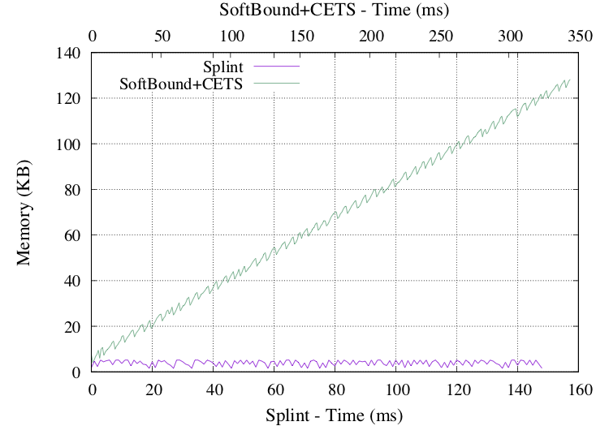

# Memory Safety - Splint vs SoftBound+CETS

Benchmark of memory safety tools - Splint and Softbound+CETS

Beachmarking was done to evaluate  
&nbsp;&nbsp;&nbsp;&nbsp;  1. Effectiveness of tool  
&nbsp;&nbsp;&nbsp;&nbsp;  2. Performance overhead introduces by these tools  
    
    
    
## Effectiveness of tool

A series of programs with vulberabilities were analyzed using Splint and SonftBound+CETS.
The result of the analysis is given in the table below.

| Vulberability        | Splint           | SB+CETS  |
| ------------- |:-------------:| -----:|
Buffer overflow   | yes | yes |
Use after free (dangling pointers)   | yes   | yes  |
Memory leak   | yes   | no  |
Double free   | yes   | yes  |
Undefined memory access   | yes   | yes  |
Stack variable reference   | yes   | yes  |
Buffer over-read   | yes   | yes  |
Null pointer dereference   | yes   | yes  |
Invalid free (freeing unallocated memory in heap)   | no   | yes  |
Unwanted aliasing (Can lead race conditions) | yes   | no  |
Format string	  | yes   | no  |

It can be seen that Splint detects more vulnerabilities than SoftBound+CETS.

## Performance Overhead

Since Splint is a static analysis tool, it doesn't introduce any performance overhead. On the contrary, SoftBound+CETS is a compile time transform, which changes source code during compilation to introduce bounds check. This introduces overhead in run time as well as memory usage. Programs were written with varied amount of pointer operations to evaluate these overheads  
  
1. Heap allocation only
2. Heap allocation and deallocation
3. Heap allocation and partial deallocation
4. Heap/Stack allocation/deallocation, pointer arithmetic

The runtime of these programs is given in the graph below

    
     
      
       
The memory usage of program 3 is given in the graph below

It can be seen that memory usage in SoftBound+CETS keeps increasing even after heap deallocation. This is due to the presence of stale keys and lock present in meta data table even after deallocation. This overhead increases over time with repeated allocation and deallocation.

  
## Experiment Setup
    
All benchmark tests were evaluated on     
&nbsp;&nbsp;&nbsp;&nbsp;    - Ubuntu 64-bit VM with 8 GB RAM and 4 cores.    
&nbsp;&nbsp;&nbsp;&nbsp;    - Compiler - clang version 3.4

      
      
      
      
      
##### This work is part of System Security Assignment 2 (CS5231)
